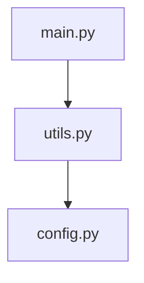

# Define Scope and Technical Plan for `update-maps` v0.4 Improvements

**Date**: 2026-05-15  
**Reporter**: Grok  
**Severity**: high  
**Category**: import  
**Milestone**: M2 - Dependency Intelligence  
**Labels**: v0.4

---

## 1. Vision & Goal

The goal of Milestone 2 is to transform `update-maps` from a near-placeholder into a **genuinely useful dependency analysis tool** that agents can rely on.

This is one of the highest-leverage features in the entire v0.4 roadmap because accurate import/dependency information allows agents to:

- Understand module boundaries
- Identify relevant files more precisely
- Significantly reduce token usage by avoiding unnecessary context
- Perform better impact analysis and refactoring planning

---

## 2. Target Languages for v0.4

We will prioritize the following languages:

| Language          | Priority | Depth of Support in v0.4                          | Notes |
|-------------------|----------|----------------------------------------------------|-------|
| **Python**        | High     | Full support (import, from-import, relative)      | Most important |
| **JavaScript/TypeScript** | High | Good support (ES modules + CommonJS)             | Very common in modern codebases |
| **Shell**         | Medium   | Basic support (source, ., simple function calls)  | Useful for scripts and build systems |

**Out of scope for v0.4**:
- Go, Java, C/C++, Rust, Ruby, PHP, etc.
- Transitive dependency resolution (only direct imports)
- Call graph analysis (only module/file-level dependencies)

---

## 3. Scope for v0.4 ("Good Enough")

The following capabilities should be delivered:

- Detect **direct** imports/requires/includes with reasonable accuracy
- Build a **directed dependency graph** (Mermaid `graph TD`)
- Provide **reverse dependencies** ("What imports this file?")
- Generate a **per-file import summary** (what each file imports)
- Output both:
  - Human-readable markdown (improved `library.md`)
  - Optional machine-readable data (simple JSON section for agents)
- Stay **zero external dependencies** — lightweight, regex + heuristic based parsing

**Non-goals for v0.4**:
- Perfect parsing (some edge cases will be missed)
- Package-level dependency resolution (e.g., `node_modules` or PyPI packages)
- Performance optimization for extremely large monorepos
- Visualizations beyond Mermaid

---

## 4. Technical Approach

- **Lightweight, language-specific parsers** using regex + heuristics (no tree-sitter, no external libraries).
- Modular design: one parser per language, easy to extend later.
- Output will be generated into `library.md` with improved structure.
- A small structured data section (or separate file) will be added for agent consumption.
- Use the existing `build_exclude_expr` and monitored paths logic for consistency.

**Why this approach?**
- Maintains the zero-dependency philosophy of the project.
- Keeps the tool lightweight and fast.
- Delivers 80% of the value with 20% of the complexity.

---

## 5. Output Format Improvements

Current output is very weak. v0.4 should deliver:

- A much more accurate and connected **Mermaid dependency graph**
- A **"Files and Their Imports"** section with real data
- A **"Reverse Dependencies"** section (very valuable for agents)
- Optional structured data (e.g., a JSON block or YAML section) that agents can parse reliably

Example desired structure (high-level):

```markdown
## Dependency Graph (Mermaid)



## Per-File Imports

| File       | Imports                          |
|------------|----------------------------------|
| main.py    | utils, config, logging           |
| utils.py   | config                           |

## Reverse Dependencies

| File       | Imported By                      |
|------------|----------------------------------|
| config.py  | main.py, utils.py, auth.py       |
```

---

## 6. Definition of Success for v0.4

`update-maps` will be considered successful for v0.4 if:

- Python import detection works reliably on real-world codebases.
- At least one other language (JS/TS or Shell) has meaningful support.
- The generated Mermaid graph shows real, useful relationships (not just placeholder nodes).
- Agents can use the output to meaningfully reduce context and understand project structure.
- The output is clearly superior to the v0.3 placeholder version.

---

## 7. Phased Implementation Plan (Proposed Tasks)

We will break M2 into the following sub-tasks:

| Task ID | Task Name                                      | Size   | Priority | Dependencies |
|---------|------------------------------------------------|--------|----------|--------------|
| M2-01   | Complete planning & scope definition (this doc) | Small  | High     | — |
| M2-02   | Implement Python import parser (core)          | Medium | Critical | M2-01 |
| M2-03   | Implement JavaScript/TypeScript parser         | Medium | High     | M2-01 |
| M2-04   | Implement basic Shell script parser            | Small  | Medium   | M2-01 |
| M2-05   | Build improved Mermaid graph generator         | Medium | High     | M2-02, M2-03 |
| M2-06   | Add reverse dependency (who imports me?)       | Medium | High     | M2-05 |
| M2-07   | Improve `library.md` output format + structure | Medium | Medium   | M2-05 |
| M2-08   | Add optional structured/JSON output for agents | Small  | Medium   | M2-07 |
| M2-09   | Testing + dogfooding on real projects          | Medium | High     | M2-02..08 |
| M2-10   | Documentation & `skills/run.md` updates        | Small  | Medium   | M2-09 |

---

## 8. Risks & Mitigations

- **Risk**: Over-scoping and trying to support too many languages perfectly.  
  **Mitigation**: Strict language priority + "good enough" definition.

- **Risk**: Regex-based parsing being too brittle.  
  **Mitigation**: Focus on common patterns first. Accept that some edge cases will be missed in v0.4.

- **Risk**: Performance issues on very large codebases.  
  **Mitigation**: Limit depth and use `head` / early filtering where appropriate.

---

## 9. Success Criteria (Tied to v0.4 Success Marker #3)

- `update-maps` produces output that is **clearly more useful** than the v0.3 placeholder.
- Python support is reliable enough for real agent workflows.
- At least one additional language has meaningful support.
- Agents can use the generated graph and summaries to reduce context and understand code structure.

---

**Status**: Planning Complete (this document)  
**Next Step**: Begin implementation with M2-02 (Python parser) once this plan is approved.

---

*This document fulfills the original planning issue for Milestone 2.*