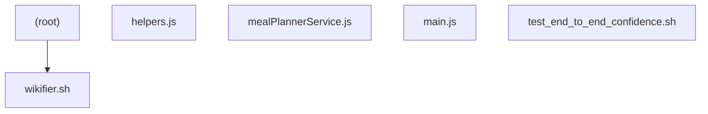

# Library & Imports Map (auto-generated by wikifier update-maps)

> This file is regenerated. Manual edits will be overwritten.
> Run `wikifier record-change library.md "..."` if you need to annotate.

## Dependency Graph (Mermaid)

## Files with Imports (summary)

| File | Detected Import Lines (truncated) |
|------|-----------------------------------|
| ./test_end_to_end_confidence.sh:import sys, json |

